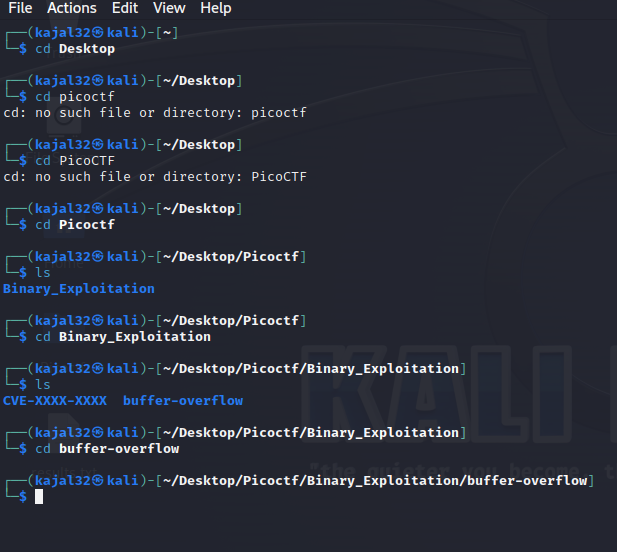
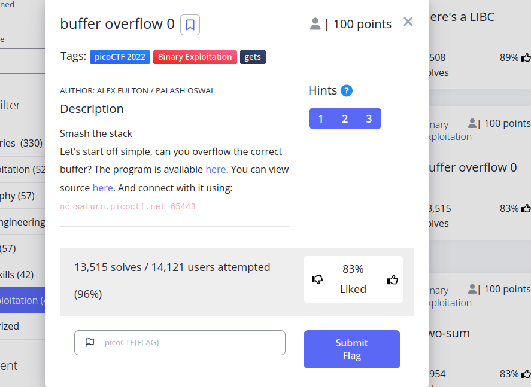
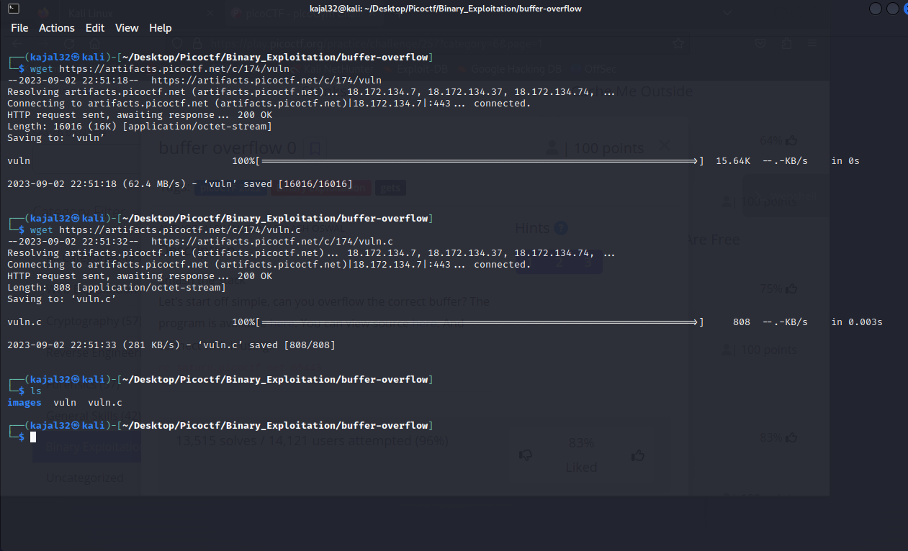
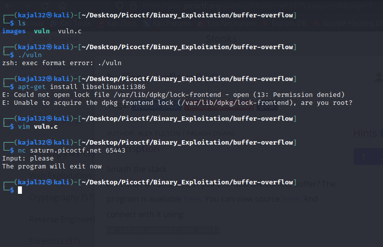
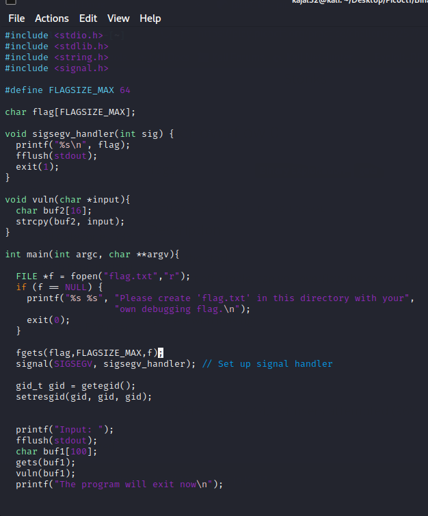
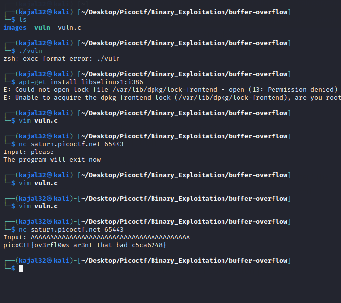

<h2> Buffer-overflow 0</h2>

1. The first step for this problem I did was to create a buffer-overflow directory

2. Then after both program and sorce code was downloaded using ``wget`` command

3. I tried executing  ``vuln`` file but could not execute due to different in architecture. Then I opened ``vuln.c`` file which is source code using ``vim`` editor

4. Here is the source code:
   We see that ``sigsev_handler`` prints a flag. ``sigsev_handler`` is a segmentation fault which can be exploited to get the fault. On the last lines we see ``gets`` function which takes ``buf1`` input without specified length and pass it to ``vuln`` which then passes to ``vuln`` function using ``strcpy``. 

5. We can overflow the function by passing undetermined length of input and then we get the flag.

<h2> Learned Concepts </h2>
