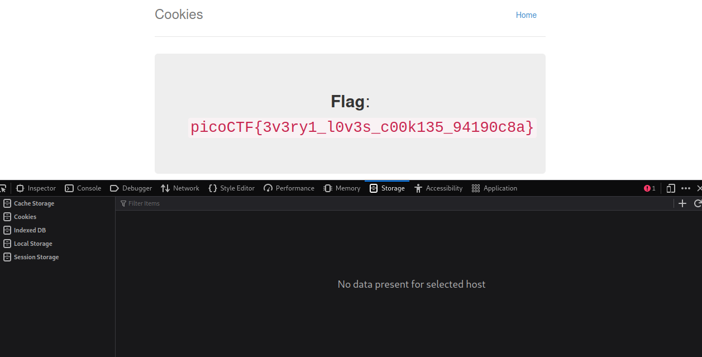

<h2> Cookies </h2>

Here is the problem set:

1. At first I inspected the site, and clicked the storage tab, there I found value stores for the cookies which we would change. As I changed the value, the content displayed on the browser was also changed.

, 

2. As I increased the value to 18, I got the flag. I learned it through various write-ups available.

<h2> Learned Concepts </h2>

<B> Cookies:</B> Cookies are small files that are stored on a user’s computer which hold a modest amount of data to a particular client or website and can be accessed either by the web server or client computer. For instance, when you select your language in which you want to view your website, the website would save the information in a document called a cookie on your computer, and the next time when you visit the website, it would be able to read a cookie saved earlier.  There are different types of cookies Session cookies, Persistent cookies, Third-party cookies, and HTTP cookies.

<B>Cookies manipulation:</B> Cookie tampering or manipulation is a technique in which an attacker manipulates or modifies the information of the stored data on a web browser. It includes all kinds of information like personal information and credentials for certain websites. There are different ways to tamper cookies which are: Manipulating in browser, Manipulating the Response, Check for cookies flags, and common data encoding.

<B>Cookies</B> can be inspected in the ``storage`` tab.
