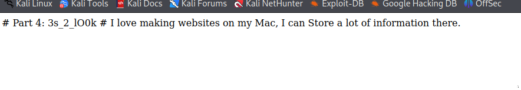

<h2> Scavenger Hunt </h2>
Here is the task:

1. Here the first step I did was to inspect ``html`` part of the website where I got my first flag: ``picoCTF{t``

2. The second step is that I inspected ``css`` parth of the website where I got my second flag: ``h4ts_4_l0``

3. In next step, I got hint from ``.js``file. So, how googled ``how can I keep google from indexing my website``

4. In this step I got the answer and typed ``robots.txt/`` at the end of URL, and got the flag: ``t_0f_pl4c``

5. And with Apache server hint, I typed ``.htaccess`` and got the flag: ``3s_2_lO0k``

6. With the hint of ``Store`` I typed ``.DS_Store`` at the end of URL and got the final flag: ``_d375c750}``

So, the flag is: ``picoCTF{th4ts_4_l0t_0f_pl4c3s_2_lO0k_d375c750}``

<h2> Learned Concepts </h2>

Elements of the website are ``HTML, CSS, and JavaScript``

<B>Robots.txt: </B> A robots.txt file is used primarily to manage crawler traffic to your site, and usually to keep a file off Google, depending on the file type.

<B> .htaccess: </B> The .htaccess (short for 'hypertext access') file is a distributed server configuration file. This means that it configures the server only in the directory the .htaccess file is in. The .htaccess file allows you to set server configurations for a specific directory. This could be the root directory for your website or an /images or /downloads directory. It is used on the Apache web server.

<B>DS_Store files:</B>  The .DS_Store file, which stands for Desktop Services Store is an invisible file that gets automatically created anytime you open a folder with Finder on the macOS. This file will then follow the folder everywhere it goes, including when it is compressed in a ZIP file. The .DS_Store file stores the metadata of its containing folder and also the names of other files in the directory. If accidentally shared, you may be exposing private files to be viewed by an outside party.

